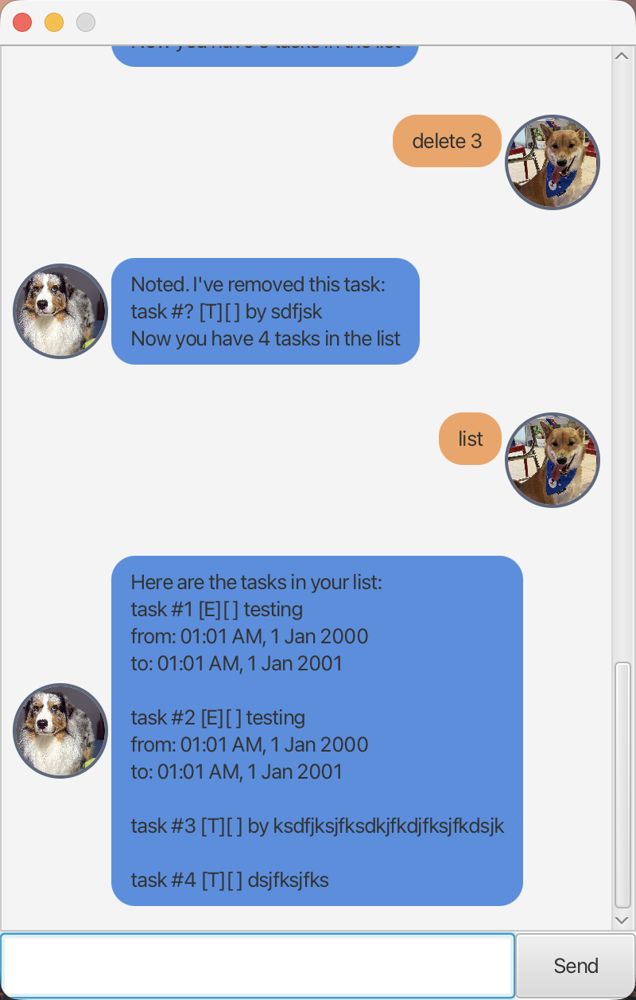

# Baron User Guide

Baron is a desktop task manager for to-dos, deadlines, events, and dependent
tasks. Enter a command in the input field and press **Enter** or click **Send**.
Baron saves changes automatically.

Guide revision: 22 September 2026



## Quick start

You need **Java 25** and the `baron.jar` file supplied with the release or
submission. Open a terminal in the folder containing the JAR, then run:

```bash
java -jar "baron.jar"
```

Baron opens in a separate window. Keep the terminal open while using it. Start
Baron again later by running the same command from the same folder.

## Important rules

These rules apply to every command:

- Enter one command at a time and separate words with spaces.
- Command names and searches are case-sensitive. For example, use `list`, not
  `List`.
- If Baron reports an error, the command is not applied. Correct the command
  and try again.
- Task numbers are one-based: the first task is task `1`. Use the number shown
  by `list` or `find`.

## Features

---

### Add a task without a date or time

#### Command

```text
todo <description>
```

#### Rules

- The description is required.
- The description cannot contain `|` or line breaks.

#### Examples

```text
> todo buy groceries
Got it. I've added this task:
task #1 [T][ ] buy groceries
Now you have 1 tasks in the list
```

#### Possible errors

```text
> todo
Missing argument for todo
```

```text
> todo buy|groceries
Descriptions must not contain '|', newlines, or carriage returns
```

---

### Add a task due at a date and time

#### Command

```text
deadline <description> /by <date and time>
```

#### Rules

- The `/by` flag and a date/time are required.
- Dates use `ddMMyyyy HHmm` in 24-hour time.
- Baron accepts past dates.

#### Examples

```text
> deadline submit report /by 30102026 1800
Got it. I've added this task:
task #1 [D][ ] submit report
by: 06:00 PM, 30 Oct 2026
Now you have 1 tasks in the list
```

#### Possible errors

```text
> deadline submit report /by tomorrow
Date/time must be in ddMMyyyy HHmm
```

```text
> deadline submit report
Missing flag /by
```

---

### Add an event with a start and end

#### Command

```text
event <description> /from <start> /to <end>
```

#### Rules

- Both `/from` and `/to` are required.
- Dates use `ddMMyyyy HHmm` in 24-hour time.
- The end must be later than the start.

#### Examples

```text
> event team meeting /from 31102026 1000 /to 31102026 1130
Got it. I've added this task:
task #1 [E][ ] team meeting
from: 10:00 AM, 31 Oct 2026
to: 11:30 AM, 31 Oct 2026
Now you have 1 tasks in the list
```

#### Possible errors

```text
> event meeting /from 31102026 1100 /to 31102026 1000
/to date must be after /from date
```

```text
> event team meeting /from 31102026 1000
Missing flag /to
```

---

### List tasks, optionally with dependencies

#### Command

```text
list [ /requires ] [ /unlocks ]
```

#### Rules

- The `/requires` and `/unlocks` flags are optional and may be combined.
- An empty task list produces `There are no tasks in your list`.

#### Examples

```text
> list
Here are the tasks in your list:
task #1 [T][ ] buy groceries

task #2 [D][ ] submit report
by: 06:00 PM, 30 Oct 2026

task #3 [E][ ] team meeting
from: 10:00 AM, 31 Oct 2026
to: 11:30 AM, 31 Oct 2026
```

#### Possible errors

```text
> list
There are no tasks in your list
```

```text
> list /requires /requires
Flag /requires must not be specified more than once
```

---

### Mark a task as done or not done

#### Command

```text
mark <task number>
unmark <task number>
```

#### Rules

- The task number must identify an existing task.
- A task cannot be marked done while a prerequisite is incomplete.
- A prerequisite cannot be marked not done while a dependent task is already
  done.

#### Examples

Assume `list` shows `task #1 [T][ ] buy groceries`.

```text
> mark 1
Nice! I've marked this task as done:
task #1 [T][X] buy groceries
```

For `unmark`, the same task-number rule applies:

```text
> unmark 1
OK, I've marked this task as not done yet:
task #1 [T][ ] buy groceries
```

#### Possible errors

```text
> mark one
Task number must be an integer
```

```text
> mark 4
Invalid task index
```

```text
> mark 2
Cannot mark task #2 as done because the following tasks are not done:
task #1 [T][ ] read lecture notes
```

---

### Delete a task

#### Command

```text
delete <task number>
```

#### Rules

- The task number must identify an existing task.
- Deleting a task also removes every dependency relationship involving it.
- Review `list /requires /unlocks` afterward if you use dependencies.

#### Examples

Assume `list` shows `task #1 [T][ ] buy groceries`.

```text
> delete 1
Noted. I've removed this task:
task #? [T][ ] buy groceries
Now you have 0 tasks in the list
```

#### Possible errors

```text
> delete 4
Invalid task index
```

```text
> delete one
Task number must be an integer
```

---

### Find tasks

#### Command

```text
find <text>
```

#### Rules

- The search text is required.
- Searches are case-sensitive and match any part of a description. For example,
  `find port` matches `submit report`.
- Search results keep their original task numbers.

#### Examples

Assume the task list contains `task #2 [D][ ] submit report`.

```text
> find report
Here are the matching tasks in your list:
task #2 [D][ ] submit report
by: 06:00 PM, 30 Oct 2026
```

#### Possible errors

```text
> find presentation
None of your tasks match 'presentation'
```

```text
> find
Missing argument for find
```

---

### Specify task dependencies

#### Command

```text
specify <task number> /requires <task numbers> /unlocks <task numbers>
```

#### Rules

- The task number must identify an existing task.
- Both flags are required.
- The task after `specify` is the task whose dependency relationships you are
  defining.
- A task listed after `/requires` is a prerequisite: it must be completed before
  the specified task can be marked done.
- A task listed after `/unlocks` is a dependent task: it depends on the
  specified task.
- Replaces the existing relationships for the specified task.
- Circular dependencies and conflicting relationships are rejected. 

#### Examples

Assume task 1 is `read lecture notes` and task 2 is `submit assignment`.

```text
> todo read lecture notes
...
> deadline submit assignment /by 30102026 1800
...
> specify 2 /requires 1 /unlocks -
Noted. I've specified this task:
task #2 [T][ ] submit assignment
requires:
#1 [T][ ] read lecture notes
```

Use `-` when it does not require or unlock another task.

```text
specify 3 /requires - /unlocks -
```

#### Possible errors

```text
> specify 2 /requires 1
Missing flag /unlocks
```

```text
> specify 1 /requires 2 /unlocks -
#1 cannot require #2 because #1 unlocks #2
```

---

### Close Baron

#### Command

Use `bye` to close Baron. The input is disabled and the window closes shortly
afterward.

#### Examples

```text
> bye
Bye. Hope you have a wonderful day!
```

---

## Data storage and recovery

Baron saves tasks in `data/tasks.txt`, relative to the folder from which you
run `baron.jar`. The file and its `data` folder are created automatically. Run
the JAR from the same folder each time to keep using the same task list.

To back up your tasks, copy `data/tasks.txt` while Baron is closed. If Baron
reports that saved data could not be restored, keep a copy of the file before
editing or replacing it. Baron skips records it cannot read and warns you when
it starts.

---

## Troubleshooting

| Problem | What to do |
| --- | --- |
| `Unknown command` | Check the command spelling against the command summary. |
| `Invalid task index` | Run `list` or `find` and use one of the displayed task numbers. |
| A date/time format error | Use eight date digits, a space, then four time digits: `ddMMyyyy HHmm`. |
| Baron cannot save tasks | Check that the `data` folder and `tasks.txt` are writable, then restart Baron. |
| The app does not start | Confirm that Java 25 is installed and run `java -jar "baron.jar"` from the folder containing the JAR. |

---

## Command summary

| Command | Purpose |
| --- | --- |
| `todo <description>` | Add a task without a date or time. |
| `deadline <description> /by <date and time>` | Add a task due at a date and time. |
| `event <description> /from <start> /to <end>` | Add an event with a start and end. |
| `list [ /requires ] [ /unlocks ]` | List tasks, optionally with dependencies. |
| `mark <task number>` | Mark a task as done. |
| `unmark <task number>` | Mark a task as not done. |
| `delete <task number>` | Delete a task. |
| `find <text>` | Search task descriptions. |
| `specify <task number> /requires <numbers> /unlocks <numbers>` | Specify task dependencies. |
| `bye` | Close Baron. |
